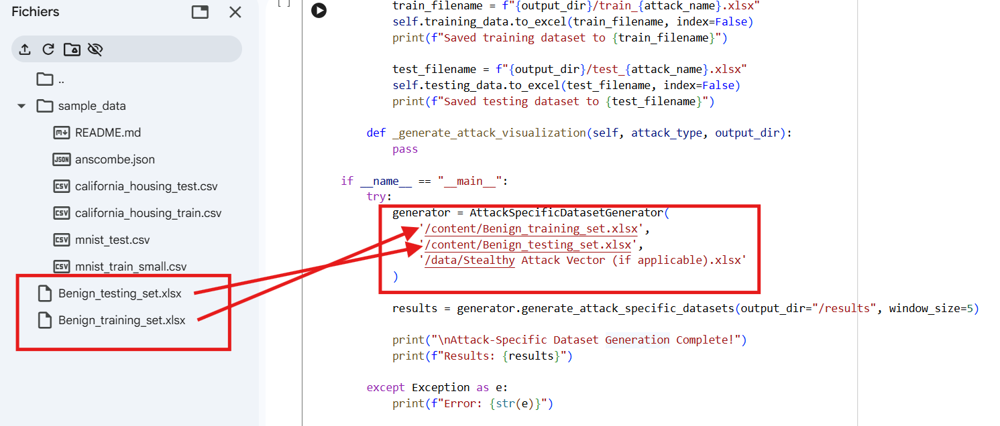
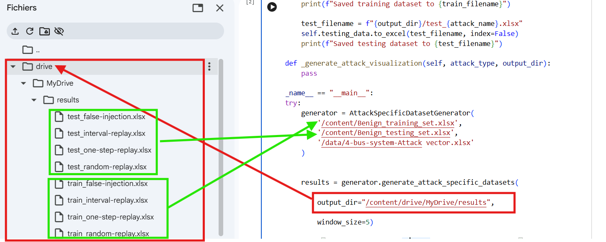
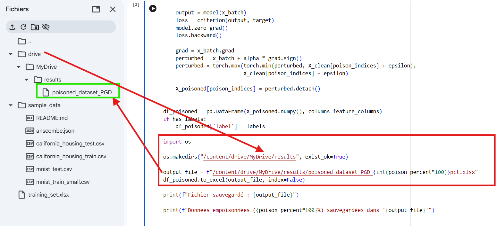

# Brief Description : 
In this repository, we provide two Python implementations: the Unpoisoned Attack Scenario and the Poisoned Attack Scenario. The first simulates stealthy cyber attacks on benign training and testing datasets, where samples are labeled as benign (0) or attack (1). It includes False Data Injection Attacks (FDIA) and replay attack variants, and is used to train supervised models and evaluate both supervised and unsupervised models.

The second script generates adversarial examples using a Projected Gradient Descent (PGD) attack on labeled or unlabeled training data. The resulting poisoned datasets are used for adversarial training of both supervised and unsupervised models. 

Note : 
It is worth noting that the output datasets should be numerical and structured in a tabular format, with features organized as columns and samples as rows.

## Usage and Key Functionalities

*Unpoisoned Attack Scenario* : 

To execute the *Unpoisoned Attack Scenario* source code, load the script in a runtime environment such as Google Colab or Jupyter Notebook. Then, provide the training dataset and the testing dataset as input files, and run the source code. The script will inject stealthy cyber attacks into the datasets and generate the corresponding output labled datasets for model training and evaluation. 

The following figures illustrate how to use the unpoisoned attack scenario source code and its execution outputs, respectively, in the Google Colab environment:




*Poisoned Attack Scenario* :

To execute the *Poisoned Attack Scenario* source code, load the script in a runtime environment such as Google Colab or Jupyter Notebook. Then, provide the labeled or unlabeled training dataset as the input file and run the source code. The script will simulate adversarial attacks on the training dataset and generates the corresponding output datasets for adversarial training of both supervised and unsupervised models.

The following figures illustrate how to use the poisoned attack scenario source code and its execution outputs, respectively, in the Google Colab environment:




## Installation

Python 3.0 or higher is required to run this project.

### Dependencies

The *Unpoisoned Attack Scenario* source code requires the following Python libraries:

- numpy  
- pandas


The *Poisoned Attack Scenario* source code requires the following Python libraries:

- pandas  
- PyTorch  

### Installation Example

You can install the required dependencies using the following command:

```bash
pip install numpy pandas
```bash
pip install pandas torch

Note

These libraries are already included in the Google Colab environment. However, they may need to be explicitly installed when using Jupyter Notebook or other environments where manual installation of dependencies is required.


