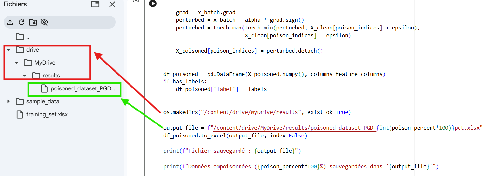

# Brief Description : 
In this repository, we provide two Python implementations: the Unpoisoned Attack Scenario and the Poisoned Attack Scenario. The first simulates stealthy cyberattacks on benign training and testing datasets and labels the samples as benign (0) or attack (1). It includes stealthy False Data Injection Attacks (FDIA) when a stealthy FDIA vector is available; otherwise, it injects random FDIA and replay attack variants. It is used to train supervised models and to evaluate both supervised and unsupervised models.

The second script generates adversarial examples using a Projected Gradient Descent (PGD) attack on labeled or unlabeled training data. The resulting poisoned datasets are used for adversarial training of both supervised and unsupervised models. 

Note : 
It is worth noting that the input datasets should be numerical and structured in a tabular format, with features organized as columns and samples as rows.

## Usage and Key Functionalities

*Unpoisoned Attack Scenario* : 

To execute the *Unpoisoned Attack Scenario* source code, load the script in a runtime environment such as Google Colab or Jupyter Notebook. Then, provide the training and testing datasets, as well as the stealthy FDIA attack vector (if available), as input files, and run the source code. The script injects stealthy cyberattacks, specifically stealthy FDIA and replay attack variants, into the datasets and generates the corresponding labeled output datasets for model training and evaluation.

The following figures illustrate how to use the unpoisoned attack scenario source code and its execution outputs, respectively, in the Google Colab environment:


*Poisoned Attack Scenario* :

To execute the *Poisoned Attack Scenario* source code, load the script in a runtime environment such as Google Colab or Jupyter Notebook. Then, provide the labeled or unlabeled training dataset as the input file and run the source code. The script will simulate adversarial attacks on the training dataset and generates the corresponding output datasets for adversarial training of both supervised and unsupervised models.

The following figures illustrate how to use the poisoned attack scenario source code and its execution outputs, respectively, in the Google Colab environment:




## Installation Procedure 
The following describes the installation procedure for the project in both Jupyter Notebook and Google Colab environments : 
## 1. Local Jupyter Notebook
Using Git, we first clone the project from GitHub, then access the repository and install the required dependencies specified in the requirements.txt file. Finally, we open the source code in a local Jupyter Notebook environment.
1. Clone the repository:
```bash
   git clone https://github.com/belkacemkadri29-png/Data_project.git
   cd Data_project
```

2. Install dependencies:
```bash
   pip install -r requirements.txt
```

3. Launch Jupyter:
```bash
   jupyter notebook "Simulation_of_poisoned_attack_scenario.ipynb"
```
4. Once Jupyter opens in your browser, click **"JupyterLab"** to open the full project.

5. Install `openpyxl` (required to read/write Excel `.xlsx` files) by running the following in a notebook cell:
```python
   !pip install openpyxl
```
### 2: Google Colab (recommended, no local setup)

1. Open the notebook directly from GitHub:
   [Simulation of Poisoned Attack Scenario](https://colab.research.google.com/github/belkacemkadri29-png/Data_project/blob/main/Simulation_of_poisoned_attack_scenario.ipynb)
   [Simulation of Unpoisoned Attack Scenario](https://colab.research.google.com/github/belkacemkadri29-png/Data_project/blob/main/Simulation_of_unpoisoned_attack_scenario.ipynb)

2. Install the required dependencies (run in the first cell):
```python
   !pip install -r requirements.txt
   !pip install openpyxl
```

# Contribution guide
## Coding Standards

### Naming Conventions
- Variables, functions,constants → `snake_case` (e.g., `poison_percent`, `apply_attack`,epsilon)
- Classes → `PascalCase` (e.g., `SimpleMLP`, `AttackSpecificDatasetGenerator`)
- Private methods → `_underscore` (e.g., `_fallback_false_injection`)

### Code Style Rules
- All imports must be placed at the top of the file
- Every class and function must include a docstring
- Always use f-strings for string formatting
- Risky operations must be handled using try/except blocks

## Branch Management

The project is currently maintained using a single `main` branch, which contains the stable and final version of the code. All updates and modifications are directly integrated into this branch.

Future improvements or experimental features may be developed in separate branches if needed, before being merged into the main branch.

## Pull Request Process

Contributors who wish to improve the project can fork the repository, create a new branch, and make their modifications independently. Once the changes are completed and tested, they can submit a pull request to propose merging their updates into the main branch.

All pull requests will be reviewed before being accepted or merged into the project.

# License

This project is licensed under the MIT License.

# Contact Information

For any questions, please contact:

belkacemkadri29@gmail.com
